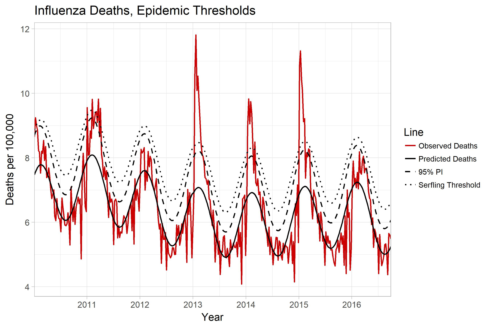

flumodelr: An R Package for Estimating Attributable Influenza Morbidity and Mortality
===============
  
[Image obtained from: https://www.cdc.gov/flu/weekly/]

# Authors  
Kevin W. McConeghy, Rob Van Aalst, Andrew Zullo  

# Overview  
The following software is a collection of R functions and datasets to examine attributable influenza morbidity and mortality. The software draws from multiple peer-reviewed studies, as well as unpublished SAS and R code developed by other researchers (see acknowledgements).  

# Installation  
```{r, eval=F}
# install from CRAN: (Not implemented yet)
install.packages("flumodelr")

# Or the the development version from GitHub:
# install.packages("devtools")
devtools::install_github("kmcconeghy/flumodelr")
```

### Warning. This package relies heavily of the suite of packages and programming termed 'Tidyverse' which includes several well-known packages e.g. "dplyr", "lubridate", that must be installed for proper functioning.  

# Usage  

The primary goal of this package is to provide a toolkit for researchers who wish to estimate the proportion of a particular outcome which is due to influenza. Conceptually this is achieved through estimating a baseline rate of the outcome across seasons, then using a measure of influenza endemicity to identify the marginal rate due to influenza morbidity. The particular measure of influenza endemicity and outcome being modelled can be arbitrarily specified by the user.  

# Latest Version Updates  

This package is in the early stages of development. Many features may change in a short amount of time.  

# Future Goals for flumodelr  

The current objective is to successfully recreate the basic Surfling model.  

We hope to increase the number of modelling options periodically including, bayesian estimation, advancing forecasting, and machine learning.  

# Important Citations 
Serfling RE. Methods for current statistical analysis of excess pneumonia-influenza deaths. Public Health Rep. 1963 Jun; 78(6): 494 - 506.  [Pubmed Link](https://www.ncbi.nlm.nih.gov/pmc/articles/PMC1915276/)  

# Acknowledgements  

The programming was derived with guidance and example code from the following individuals.  

* Yenong and Ellyn Russo. White River Junction VA Medical Center, VT. Department of Veteran Affairs.  

* Baltazar Nunes. Researcher, Epidemiological Research Unit (Head), Departament of Epidemiology.  