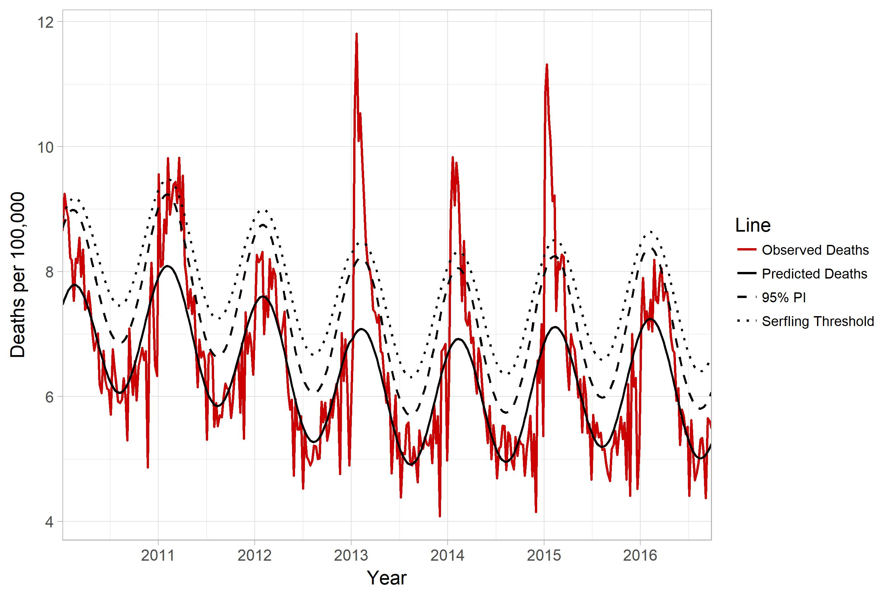

flumodelr: An R Package for Estimating Attributable Influenza Morbidity and Mortality
===============

  

# Overview  
The following software is a collection of R functions and datasets to examine attributable influenza morbidity and mortality. The software draws from multiple peer-reviewed studies, as well as unpublished SAS and R code developed by other researchers (see acknowledgements).  

# Installation  
```{r, eval=F}
# install from CRAN: (Not implemented yet)
install.packages("flumodelr")

# Or the the development version from GitHub:
# install.packages("devtools")
devtools::install_github("kmcconeghy/flumodelr")
```
This package relies heavily on the suite of packages and programming termed "Tidyverse", e.g. "dplyr", "lubridate", that must be installed for proper functioning.  

# Usage  
The primary goal of this package is to provide a toolkit for researchers who wish to estimate the attributable proportion of an outcome due to influenza morbidity and mortality. Conceptually this is achieved through estimating a baseline rate of the outcome in the absence of influenza, then using a measure of influenza endemicity to identify the marginal rate due to influenza morbidity. The particular measure of influenza endemicity and outcome being modelled can be arbitrarily specified by the user.  

# Simple Example  
```{r, include=F}
library(flumodelr, quietly = T, warn.conflicts = F)
library(tidyverse, quietly = T, warn.conflicts = F)
```

### Example data  
```{r }
fludta <- fludta
fludta
```

### Fit Traditional Serfling Model
```{r }
flu_fit <- fluserf(fludta, outc = perc_fludeaths, time = yrweek_dt)
```

Assumes epidemic influenza period of Sept. - May.  Fits a cyclical trend line, y0, along with an threshold limit for epidemicity, y0_ul.  

```{r }
flu_fit %>% select (year, week, perc_fludeaths, y0, y0_ul)
```

### Influenza Time-Series Plot  
An convenience function for plotting the above fit lines.  
```{r }
fluplot(flu_fit, xvar=yrweek_dt, perc_fludeaths, y0, y0_ul,
                    ylab="% Deaths due to P&I", title="Serfling Model")
```

# Vignettes  
Several companion documents have been written to assist interested readers with the background and use of the package. We suggest you start here:
[Introduction to flumodelr](https://kmcconeghy.github.io/flumodelr/index.html) or if the package is installed:  
```{r, eval=F}
vignette("01-Introduction", "flumodelr")
```

# Latest Version Updates  
This package is in the early stages of development. Many features may change in a short amount of time.  

# Future Goals for flumodelr  
The basic Serfling model is now functional. Current efforts are focused on modern virology models and comparing results to other researchers.  

We hope to increase the number of modelling options periodically including, bayesian estimation, advancing forecasting, and machine learning.  

# Important References   
 1. Serfling RE. Methods for current statistical analysis of excess pneumonia-influenza deaths. Public Health Rep. 1963 Jun; 78(6): 494 - 506.  [Pubmed Link](https://www.ncbi.nlm.nih.gov/pmc/articles/PMC1915276/)  

 2. Thompson WW1, Weintraub E, Dhankhar P, Cheng PY, Brammer L, Meltzer MI, Bresee JS, Shay DK. Estimates of US influenza-associated deaths made using four different methods. Influenza Other Respir Viruses. 2009 Jan;3(1):37-49. [Pubmed Link](https://www.ncbi.nlm.nih.gov/pubmed/19453440)

# Authors  
Kevin W. McConeghy, Pharm.D, M.S., Brown University School of Public Health, Dept. Health Services Research  
Rob Van Aalst, Sanofi-Pasteur  
Andrew Zullo, Pharm.D., MSc, Ph.D., Brown University School of Public Health, Dept. Health Services Research  
Nina Joyce, Ph.D., Brown University School of Public Health, Dept. Health Services Research  

# Acknowledgements  
The programming was derived with guidance and example code from the following individuals.  

* Yinong Young-Xu and Ellyn Russo. White River Junction VA Medical Center, VT. Department of Veteran Affairs.  

* Baltazar Nunes. Researcher, Epidemiological Research Unit (Head), Departament of Epidemiology.  

